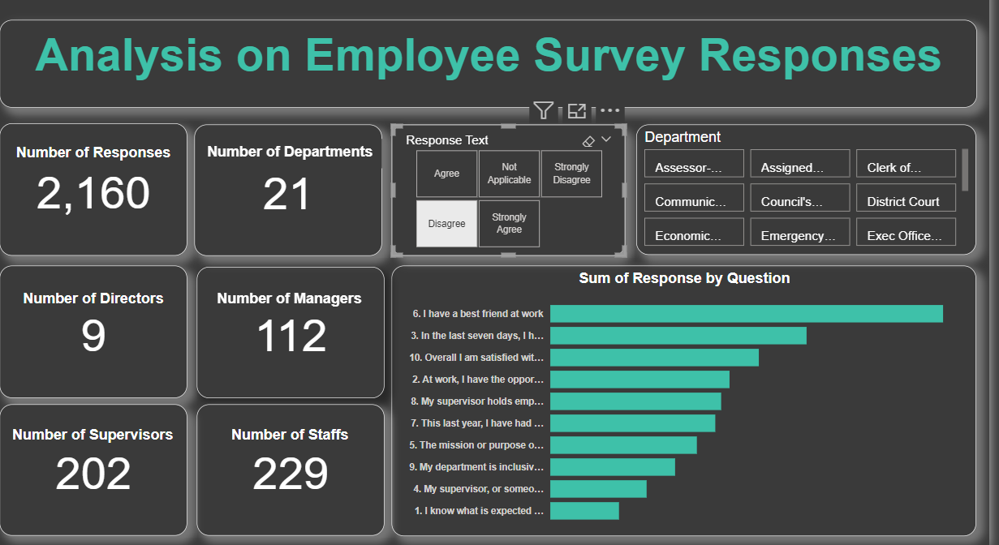
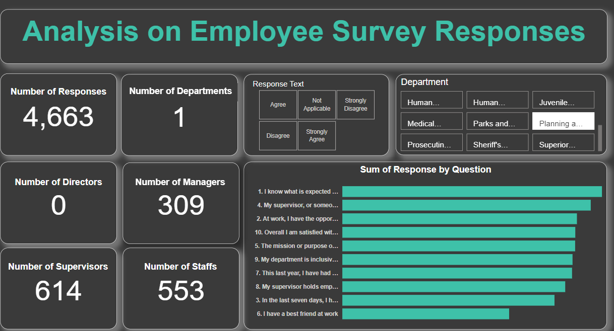

# Analysis Employee Survey Responses

## Introduction

This is a Power BI project on an Employee Survey Responses which are actual responses from an employee engagement survey conducted by Pierce County WA and completed voluntarily by government employees. The dataset is a Single table and contains 14,725 records. The total number of fields is 10.

## Problem Statement

What improvement can be done to enhance employee satisfaction?

## Skills demonstrated

The following Power BI features were incorporated;
DAX, quick measures, filtering, data modeling, tooltips.

## Data Sourcing

Click [here](https://docs.google.com/spreadsheets/d/1nbhfp2ModgqDAPveYQG9CknRw2PYJQxbOTs3xSKOB8E/edit#gid=61186505)

## Modeling

No modeling was done because only one table was given in the dataset.

## Analysis/Visualisation

1. Which survey question did respondents agree with or disagree with most?

Employees agreed with question 9 _My department is inclusive and demonstrates support of a diverse workforce_ the most, having a total of 1,989 responses. They also strongly agreed with question 1 _I know what is expected of me at work_ the most, having a total of 3,384 responses.

Agree     |     Strongly Agree
----------|-------------
|

Employees disagreed with question 6 _I have a best friend at work_ the most, having a total of 938 responses. They also strongly disagreed with question 3 _In the last seven days, I have received recognition or praise for doing good work_ the most, having a total of 189 responses.

Disagree     |     Strongly Disagree
----------|-------------
|

2. Do you see any patterns or trends by department or role?

It was noticed that the planning and public works department had 4,663 out of 14,575 responses (about 32% of the total responses) from 21 departments which is the largest number of responses per department. 

This greatly influenced the overall responses to the questions posed during the survey with 765 of the 1,989 (about 38.5%) responses agreeing to question 9 and 996 of the 3,384 (about 29.4%) responses strongly agreeing to question 1. Also having 310 of the 938 (about 33%) responses disagreeing to question 6.

Agree      |    Strongly Agree     |     Disagree
-----------|-----------------------|-------------
||

3. As an employer, what steps might you take to improve employee satisfaction based on the survey results?

Since it can be observed that most of the employees disagree with question 6 _I have a best friend at work_ and strongly disagree with question 3 _In the last seven days, I have received recognition or praise for doing good work_, the following steps should be taken to improve the employees satisfaction;

• Team building activities should be encouraged to improve interpersonal relationships between employees in various departments.

• Good communication which involves active listening, communicating clearly and concisely and constructive feedback should be greatly encouraged.

• Creating a positive work environment where everyone feels included, valued, recognized and appreciate the effort of their colleagues.

•	Creation of informal gathering such as lunch or coffee breaks, end of year or Christmas party to create opportunity for informal interactions.

•	Create appreciation avenues like ‘employee of the month’ to appreciate employees for their good work.

•	After the completion of a project, employees should be properly appreciated for their good work either verbally or by giving gifts.

